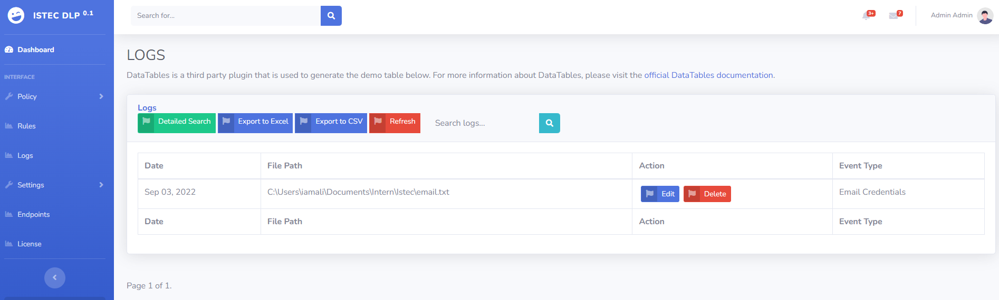
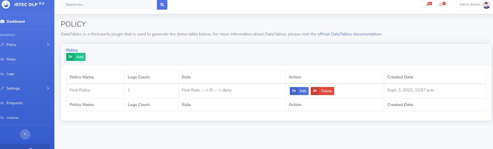
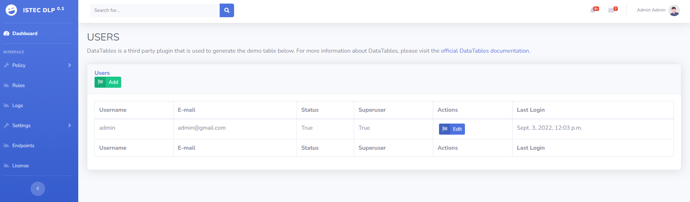

<h1 align='center'>ISTEC DLP</h1>

## Requirements
You can install the Requirements by running the command:

- Open MySQL port (3306). How to open 3306 port? ==> https://www.opendental.com/manual/port3306.html
- After opening port 3306, create a database named "dlp". Fill in the User and Password fields according to your own information(Web\main\main\settings.py[89 line]).

```
pip install -r requirements.txt
```

```
asgiref==3.5.2
autopep8==1.7.0
Django==4.1
docx==0.2.4
lxml==4.9.1
mysql==0.0.3
mysql-connector-python==8.0.29
mysqlclient==2.1.1
numpy==1.23.2
pandas==1.4.3
Pillow==9.2.0
protobuf==3.20.1
pycodestyle==2.9.1
pynput==1.7.6
PyPDF2==2.10.2
python-dateutil==2.8.2
python-docx==0.8.11
pytz==2022.2.1
six==1.16.0
sqlparse==0.4.2
toml==0.10.2
typing_extensions==4.3.0
tzdata==2022.2
watchdog==2.1.9
xlwt==1.3.0
```

## Installation
```sh
$ git clone https://github.com/istec-iuc/DLP
$ cd Web\main
$ python -m venv venv
if you are using windows:
$.\venv\Scripts\activate
if you are using linux
$source venv/bin/activate
$ pip install -r requirements.txt
$ python manage.py runserver
```

## Screenshots
<p align='center'>
     
    
    
</p>